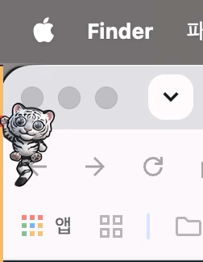
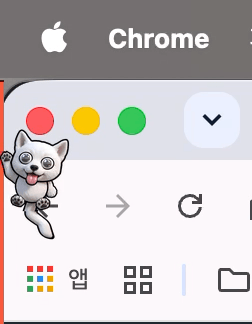

# NudgeLine

<p align="center">
  
</p>

<p align="center">
  <strong>A screen-edge timeline bar for today's calendar events on macOS</strong><br>
  <em>macOS 15+ (Sequoia) / Swift 6, SwiftUI</em>
</p>

<p align="center">
  <strong>English</strong> | <a href="README_KR.md">한국어</a>
</p>

<p align="center">
  
  
  
  
</p>

---

## Overview

NudgeLine displays your daily schedule as a thin bar along the edge of your screen (Left, Right, or Bottom).

<p align="center">
  <video src="https://github.com/user-attachments/assets/a3380d76-9313-4f39-83aa-e25fc015ea8e" width="85%" controls></video>
</p>

Key Features:

- **Mouse Passthrough**: Clicks and scrolls pass through outside the bar area.
- **Timeline Bar**: Background track, event boundary lines, and 4 indicator styles.
- **Overlapping Events**: Alternating color transitions for concurrent events.
- **Mascots**: 3 built-in animated pets with 6 hide motions, and custom pet support.
- **Meeting & Map Integration**: 1-click launch for 10 meeting platforms, automatic unwrapping of corporate SafeLinks/Redirects, and preferred map shortcuts (Apple, Google, Naver, Kakao).
- **Privacy**: Option to hide the bar during screen sharing/recording or in full-screen spaces.
- **One-Click In-App Update**: Automatic update notifications and seamless in-app download/relaunch from the menu bar.
- **Native Implementation**: Built with SwiftUI, AppKit, and EventKit with no external dependencies.

<p align="center">
  &nbsp;&nbsp;&nbsp;&nbsp;
  &nbsp;&nbsp;&nbsp;&nbsp;
  <br>
  <em>Mascots hide behind the bezel or disappear upon cursor proximity (6 motions supported).</em>
</p>

---

## Installation

### 1. via Homebrew (Recommended)

```bash
brew install rareram/tap/nudgeline
```

---

### 2. Direct Download (.dmg)

1. Download `NudgeLine.dmg` from [GitHub Releases](https://github.com/rareram/NudgeLine/releases) and move `NudgeLine.app` to `/Applications`. Subsequent updates can be installed with a single click via the menu bar.
2. **Gatekeeper Notice (First launch only)**:
   - Since this is an unsigned open-source app, macOS may prompt a security confirmation on first open.
   - Right-click (Control + Click) `NudgeLine.app` > select **Open**, or run:
     ```bash
     xattr -cr /Applications/NudgeLine.app
     ```

---

## Features

### 1. Screen-Edge Timeline
- **Position**: Left, Right, or Bottom screen edge.
- **Multi-Monitor**: Show on the primary display or across all connected screens.
- **Thickness**: Adjustable from 1px to 10px, with optional expansion on hover.
- **Overlaps**: Alternating transitions between concurrent events.
- **Past Event Dimming**: Completed events dim to 35% opacity and saturation, restoring to original colors on hover.

### 2. Time Indicators
- **Styles**: Triangle Tick, Round Dome, Protruding Block, and Point Ring.
- **Visual Effects**: Indicator color customization, rim highlight, and neon glow toggles.
- **Shortest Event Focus**: Prioritizes the shortest event when hovering over overlapping meetings.

### 3. Event Alerts & Effects
- **Pre-Event Alert**: 3-second bar pulse animation 5, 10, 15, or 20 minutes before a meeting starts.
- **Event Start Effects**: Visual alert effects (Cherry Blossom, Neon Thunder, Maple Leaf, Snow Flurry).
- **On the Hour Notification**: Optional visual alert triggered at :00 every hour.
- **Trigger Control**: Triggers once when an event starts (3-minute cooldown).

### 4. Mascot Indicators & Custom Pets
- **Built-in Pets**: Calico Cat, White Jindo Dog, and White Tiger.
- **6 Hide Motions**:
  - `tailPeek`: Hides behind the bezel with tail visible.
  - `headPeek`: Hides body with head peeking out.
  - `pop`: Shrinks and disappears.
  - `vortex`: Rotates and disappears.
  - `squish`: Squishes and disappears.
  - `smoke`: Blurs and disappears.
  - **Custom Pets**: Import PNG frame sequences, adjust FPS, configure hide offsets with live preview.

### 5. Event Popovers
- **Action Card**: Schedule details, 1-click meeting join (supports unwrapping MS SafeLinks & Google Redirects), preferred map shortcuts (Apple, Google, Naver, Kakao), and Apple Calendar shortcut.
- **Simple Tooltip**: Compact tooltip showing title and time.
- **Card Themes**: Supports System Adaptive, Dark, and Light themes with contrast adjustment for buttons and links on light backgrounds.
- **All-day Events**: Displays all-day events alongside timed schedules in popovers.
- **Empty Track Guidance**: Displays a status tooltip when hovering over empty timeline gaps.

### 6. Shortcuts & Menu Controls
- **Instant Refresh**: Re-fetch today's calendar events via the timeline bar context menu or menu bar [Refresh] item.
- **AppIntents Integration**:
  - `Refresh Schedule` / `NudgeLine 새로고침`: Refetch today's calendar events.
  - `Toggle Pet` / `NudgeLine 펫 토글`: Toggle pet visibility on the timeline bar.

### 7. Settings Window
- **Timeline**: Position, thickness, hover expand, border and neon highlights, past event dimming, background style (Auto, Dark, Light, Custom), and opacity.
- **Appearance**: Card style/theme/opacity, indicator shape/color, pre-event alert, event start effects, hourly alert, pet selection and hide motions, custom pet manager.
- **Schedule**: 24-hour mode, work hours, visible calendars with color pickers, System Settings deep link.
- **General**: Language (System, Korean, English), launch at login (`SMAppService`), multi-display, hide on screen share, hide in full screen, app info.

---

## Requirements & Build

### Requirements
- macOS 15.0+ (Sequoia)
- Apple Silicon or Intel Mac

### Build from Source

```bash
# 1. Clone repository
git clone https://github.com/rareram/NudgeLine.git
cd NudgeLine

# 2. Local development build (Isolated NudgeLine (Dev).app)
./scripts/build_app.sh
open "build/NudgeLine (Dev).app"

# Or production release build
./scripts/build_app.sh --release
open "build/NudgeLine.app"
```

### Running Unit Tests (Manual Testing)

You can manually run the unit test suite to verify the localization dictionary (L10n), default configuration models (AppSettings), and calendar event model integrity:

```bash
# Run local unit tests
./scripts/run_tests.sh

# Or directly via Swift Package Manager (Xcode environment)
swift test
```

---

## Project Structure

```
NudgeLine/
├── Package.swift                         # SPM Manifest (macOS 15+)
├── docs/
│   └── images/                           # README screenshots and icon assets
├── Resources/
│   ├── Info.plist                        # LSUIElement and calendar usage descriptions
│   └── AppIcon.icns                      # App icon
├── Sources/
│   └── NudgeLine/
│       ├── AppDelegate.swift             # App lifecycle and screen change observers
│       ├── main.swift                    # Entry point & single instance guard
│       ├── Models/
│       │   ├── AppSettings.swift         # Settings persistence via UserDefaults
│       │   └── CalendarEvent.swift       # Event model, meeting parser, safe indexing
│       ├── Services/
│       │   ├── CalendarService.swift     # EventKit background query service
│       │   ├── CustomPetService.swift    # Thread-safe custom pet file manager
│       │   ├── LaunchAtLoginHelper.swift # SMAppService login item wrapper
│       │   ├── Localization.swift        # English/Korean L10n dictionary
│       │   └── NudgeLineShortcuts.swift  # AppIntents for Shortcuts & Siri automation
│       └── Views/
│           ├── OverlayPanel.swift        # Edge floating NSPanel with mouse passthrough
│           ├── PopoverPanel.swift        # Floating popover panel with .common runloop timer & empty tooltip
│           ├── TimelineBarView.swift     # Main timeline rendering & gesture coordinator
│           ├── HangingPetIndicatorView.swift # Mascot renderer & orbit physics
│           ├── HoverRenderers.swift      # Popover renderer protocol
│           ├── EventPopoverView.swift    # Action card popover (timed & all-day multi-stack)
│           ├── SimpleInfoPopoverView.swift # Simple tooltip bubble
│           ├── CustomPetEditorSheet.swift# Custom pet drag-and-drop modal
│           ├── SettingsView.swift        # Preferences tab container
│           ├── SettingsWindowController.swift # Dedicated settings window lifecycle manager
│           ├── Settings/                 # Modular settings tabs
│           │   ├── TimelineTab.swift
│           │   ├── AppearanceTab.swift
│           │   ├── ScheduleTab.swift
│           │   └── GeneralTab.swift
│           ├── Effects/                  # 16-frame 1.0s micro event alert effects
│           │   ├── EventTriggerEffectView.swift
│           │   ├── CherryBlossomEffectAsset.swift
│           │   ├── ThunderEffectAsset.swift
│           │   ├── AutumnLeavesEffectAsset.swift
│           │   └── WinterSnowEffectAsset.swift
│           └── Pets/                     # Built-in 16-frame Base64 pet assets & interaction
│               ├── PetProtocol.swift
│               ├── InteractivePetView.swift
│               ├── InteractiveCustomPetView.swift
│               ├── CatPetAsset.swift
│               ├── JindoDogPetAsset.swift
│               └── WhiteTigerPetAsset.swift
├── Tests/
│   └── NudgeLineTests/                   # Swift Testing unit test suite
└── scripts/
    ├── build_app.sh                      # Local Dev & Release bundle packager
    ├── create_dmg.sh                     # Release DMG packaging script
    ├── run_tests.sh                      # Local unit test runner
    ├── generate_dev_icon.swift           # DEV icon badging script
    ├── generate_app_icon.sh              # Production icon generator script
    ├── generate_custom_pet.py            # CLI sprite generator for Swift models
    └── check_security.sh                 # Static secret scan script
```

---

## Localization

NudgeLine supports:
- English (Default)
- Korean (한국어)

You can change the language in **Settings > General > Language**.

---

## Credits & License

- Inspired by the concept of PixelScheduler (2014-2015) by Andreas Katzian & ARTMIXTURE.
- License: [MIT License](LICENSE).
- Copyright: (c) 2026 rareram. All rights reserved.

