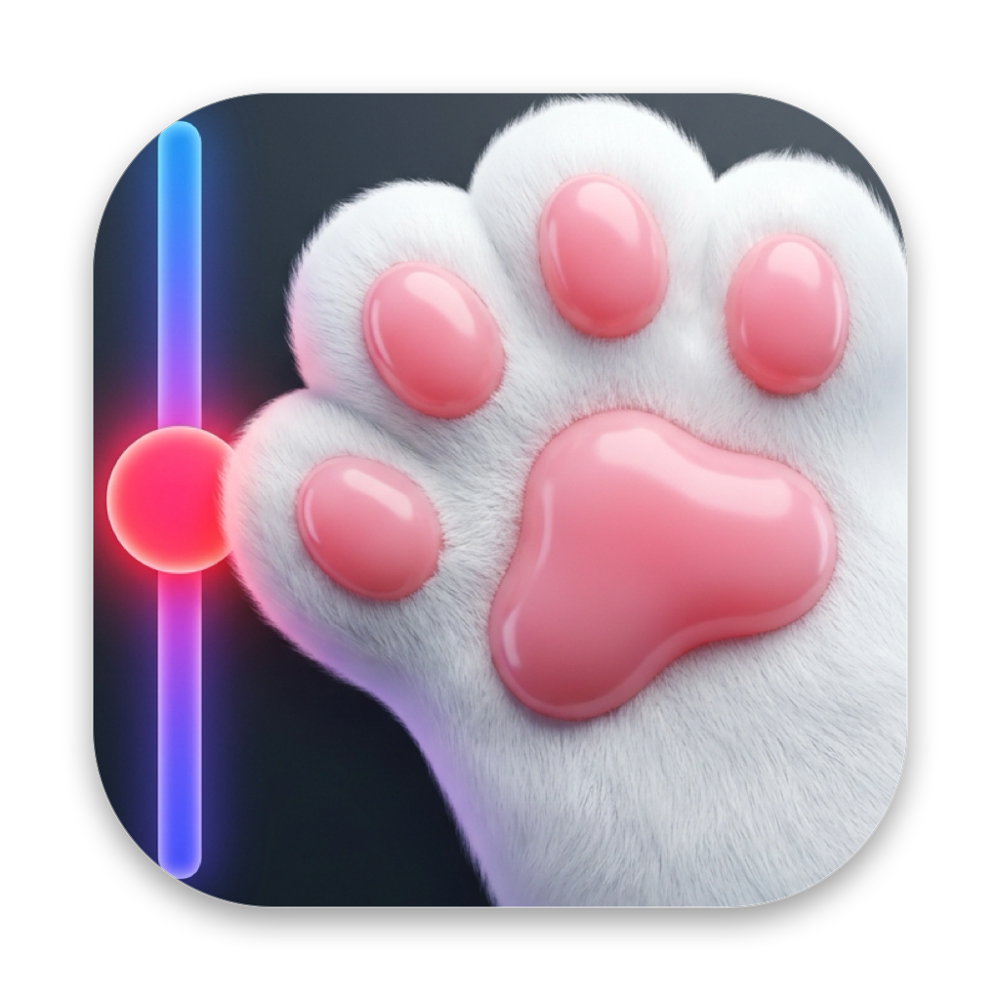
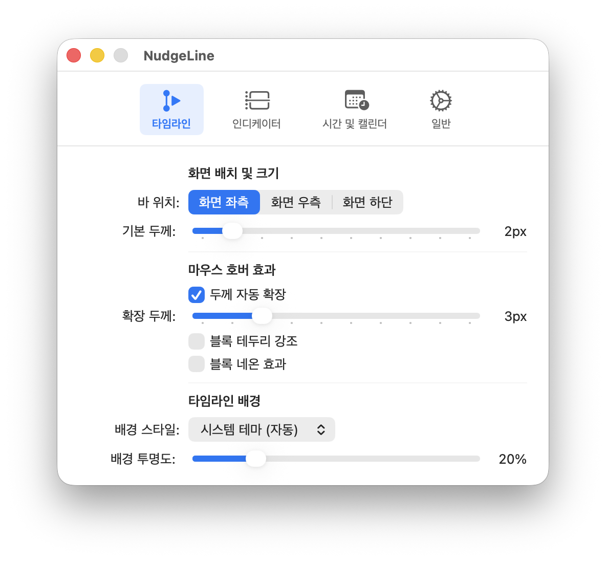
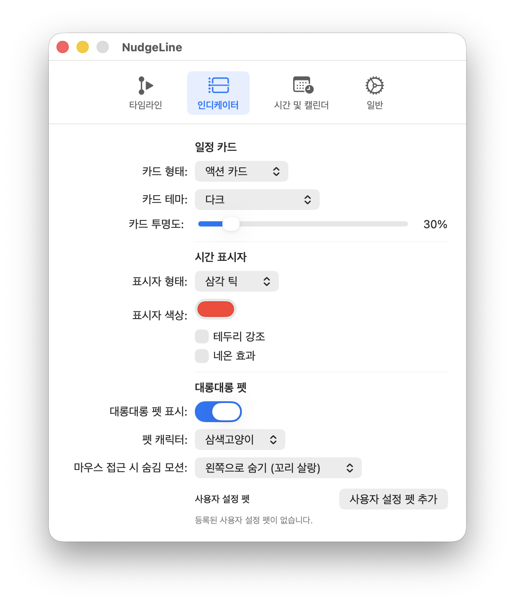
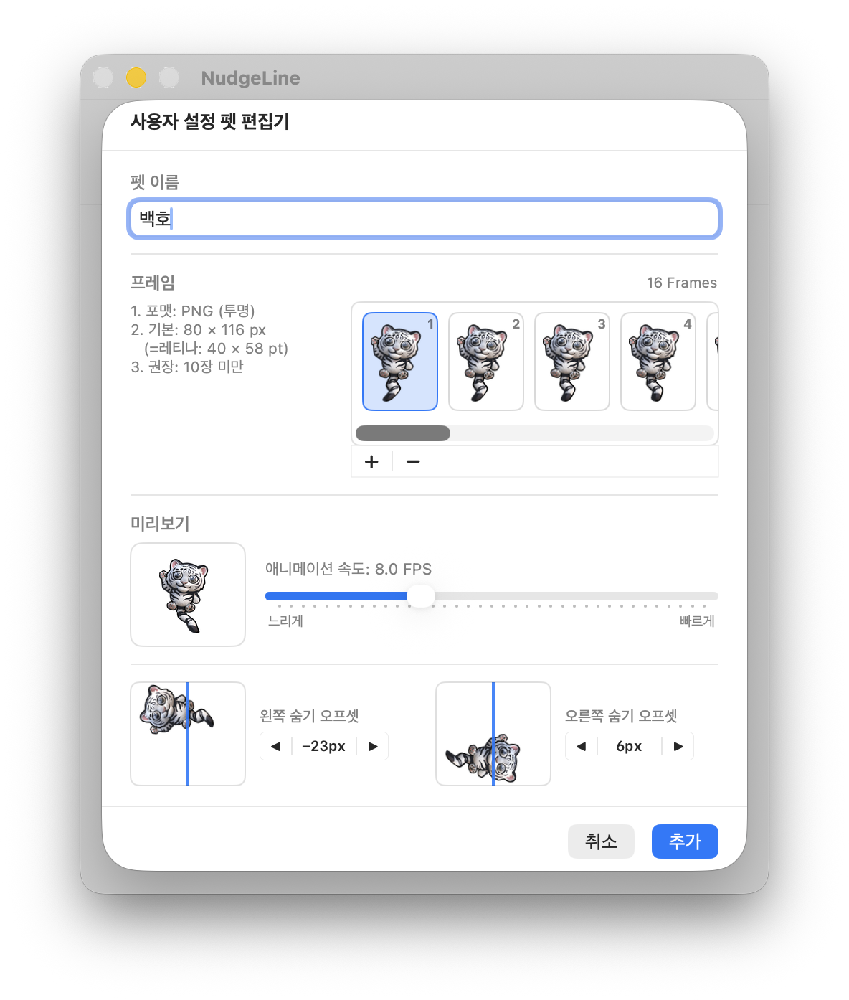
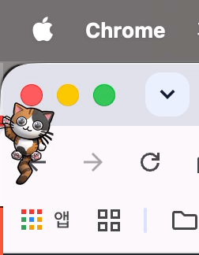

# NudgeLine (귀띔)

<p align="center">
  
</p>

<p align="center">
  <strong>화면 가장자리에서 오늘 일정을 살며시 귀띔해 주는 macOS 캘린더 타임라인 바</strong><br>
  <em>macOS 14+ (Sonoma / Sequoia) 환경을 위해 Swift 6 및 SwiftUI로 제작</em>
</p>

<p align="center">
  <a href="README.md">English</a> | <strong>한국어</strong>
</p>

<p align="center">
  
  
  
  
</p>

<p align="center">
  <a href="docs/images/settings_timeline_kr.png"></a>
  <a href="docs/images/settings_indicator_kr.png"></a>
  <a href="docs/images/custom_pet_editor_kr.png"></a>
</p>

---

## 소개

NudgeLine(귀띔)은 화면 테두리(좌측, 우측, 하단)에 얇은 선 형태로 오늘 일정을 띄워주는 macOS 앰비언트 유틸리티입니다.

<p align="center">
  <br>
  <em><strong>작업창 무간섭 & 펫 회피 동작</strong>: 마우스 클릭이 뒤쪽 창으로 그대로 통과되며, 커서 접근 시 펫이 베젤 뒤로 숨어 조작을 전혀 가리지 않습니다.</em>
</p>

작업을 방해하는 전체 화면 팝업 대신, 화면 가장자리에서 오늘 일정을 한눈에 파악할 수 있습니다:

- **마우스 패스스루**: 물리 바 두께 외 영역 마우스 클릭/스크롤 100% 관통 (뒤쪽 작업창 조작 보존)
- **미니멀 디자인**: 다크 배경 트랙, 1px 이벤트 구분선, 4종 기하학 인디케이터
- **일정 중복 처리**: 동시간대 겹치는 일정 간 부드러운 색상 교차 전환
- **마스코트 펫**: 마우스 접근 시 베젤 뒤로 회피하는 애니메이션 펫 3종 및 커스텀 펫 등록
- **화상회의 원클릭 연동**: Google Meet, Zoom, MS Teams, Webex 링크 자동 감지 및 바로 참여 버튼
- **초경량 네이티브**: 외부 라이브러리 0개, Apple 순정 프레임워크(SwiftUI, AppKit, EventKit) 기반 저전력 동작

---

## 설치 방법

### 1. Homebrew 설치 (가장 권장)

터미널에서 한 줄로 간편하게 설치하고 업데이트할 수 있습니다:

```bash
brew install rareram/tap/nudgeline
```

---

### 2. DMG 파일 직접 다운로드

1. [GitHub Releases](https://github.com/rareram/NudgeLine/releases)에서 `NudgeLine.dmg`를 다운로드하여 설치합니다.
2. **보안 경고 발생 시 (최초 1회)**:
   - 애플 개발자 등록이 되어있지 않은 오픈소스 앱이므로, 처음 열 때 확인 메시지가 나타날 수 있습니다.
   - **해결 방법**: `NudgeLine.app`을 **우클릭(Control+클릭) > [열기]**를 선택하거나, 터미널에서 아래 명령어를 실행합니다:
     ```bash
     xattr -cr /Applications/NudgeLine.app
     ```

---

## 주요 기능

### 1. 화면 테두리 타임라인 바
- **위치**: 화면 좌측, 우측, 하단
- **다중 디스플레이**: 주 모니터 전용 또는 연결된 모든 모니터 동시 표시
- **두께 조절**: 1px~10px 기본 두께 및 마우스 호버 시 확장 두께 설정
- **겹침 처리**: 동시간대 중복 일정 자동 교차 전환

### 2. 시간 표시자 (인디케이터)
- **표시자 모양**: 삼각 틱, 라운드 돔, 돌출 블록, 포인트 링
- **시각 효과**: 표시자 색상 변경, 테두리 강조, 네온 효과 토글
- **단기 일정 우선 포커스**: 여러 일정이 겹친 구간 호버 시 소요 시간이 가장 짧은 일정 우선 강조

### 3. 마스코트 펫과 숨김 모션
- **기본 펫 3종**: 삼색고양이, 진도백구, 백호 (16프레임 애니메이션)
- **6가지 숨김 동작**:
  - `tailPeek` (왼쪽으로 숨기): 머리부터 베젤 뒤로 숨고 꼬리만 살랑거림
  - `headPeek` (오른쪽으로 숨기): 몸은 숨고 머리와 눈만 쏙 빼꼼 내밈
  - `pop` (없어지기 - 팝/소멸): 작아지며 톡 터지듯 사라짐
  - `vortex` (없어지기 - 회오리): 720도 회전하며 소용돌이 속으로 사라짐
  - `squish` (없어지기 - 슬라임): 젤리처럼 납작하게 찌그러지며 사라짐
  - `smoke` (없어지기 - 연기): 흐려지고 퍼지며 연기처럼 사라짐
- **커스텀 펫 편집기**: PNG 프레임 시퀀스 등록, 속도(FPS) 조절, 좌/우 숨김 오프셋 튜닝 및 실시간 미리보기 지원

### 4. 팝오버 카드
- **상세 액션 카드**: 일정 상세 내용, 화상회의 원클릭 버튼, Apple 캘린더 바로가기 (0.22초 호버 브릿지)
- **심플 툴팁**: 제목과 시간만 간결하게 보여주는 말풍선 (마우스 벗어나면 0.04초 만에 즉시 닫힘)

### 5. 환경설정 (4개 탭)
- **타임라인**: 바 위치, 두께, 호버 확장, 배경 스타일(자동/다크/라이트/커스텀) 및 투명도
- **인디케이터**: 일정 카드 스타일/테마, 시간 표시자 모양/색상, 펫 선택, 숨김 동작, 커스텀 펫 관리
- **시간 및 캘린더**: 24시간 모드, 업무 시작/종료 시각, 표시할 캘린더 선택 및 캘린더별 색상 지정
- **일반**: 언어 선택 (시스템 기본/한국어/영어), 로그인 시 자동 실행, 다중 모니터 표시, 앱 정보

---

## 요구 사양 및 빌드

### 요구 사양
- macOS 14.0 (Sonoma) 또는 macOS 15.0+ (Sequoia)
- Apple Silicon (M1~M4) 또는 Intel Mac

### 소스코드에서 빌드하기

```bash
# 1. 저장소 복제
git clone https://github.com/rareram/NudgeLine.git
cd NudgeLine

# 2. 로컬 개발 빌드 (격리된 NudgeLine (Dev).app)
./scripts/build_app.sh
open "build/NudgeLine (Dev).app"

# 또는 정식 배포용 빌드
./scripts/build_app.sh --release
open "build/NudgeLine.app"
```

---

## 다국어 지원

- 영어 (English - 기본값)
- 한국어 (Korean)

**설정 > 일반 > 언어**에서 언제든 바꿀 수 있습니다.

---

## 크레딧 및 라이선스

- 원작 컨셉: Andreas Katzian & ARTMIXTURE의 PixelScheduler (2014-2015)
- 라이선스: [MIT License](LICENSE)
- 저작권: (c) 2026 rareram. All rights reserved.


